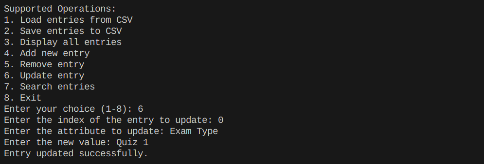

# Marks Directory

## Steps to execute

```console
python mdirectory.py
```

## Class of Inputs

### 1. Load entries from CSV


### 2. Save entries to CSV


### 3. Display all entries


### 4. Add new entry


### 5. Remove entry


### 6. Update entry



### 7. Search entries


# Map for Movements

## Steps to execute

```console
cat > input.txt
[('3mm', 'N'), ('4.5mm', 'NW'), ('2mm', 'SE')]
^D
python map.py
```

## Sample Output


# Kaoaa

## Steps to execute

```console
# pip install pygame
# pip install rich
python kaoaa.py
```

## Sample Output


